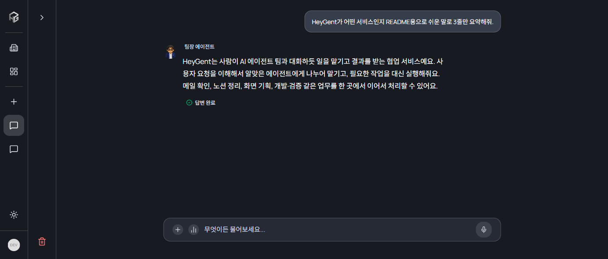
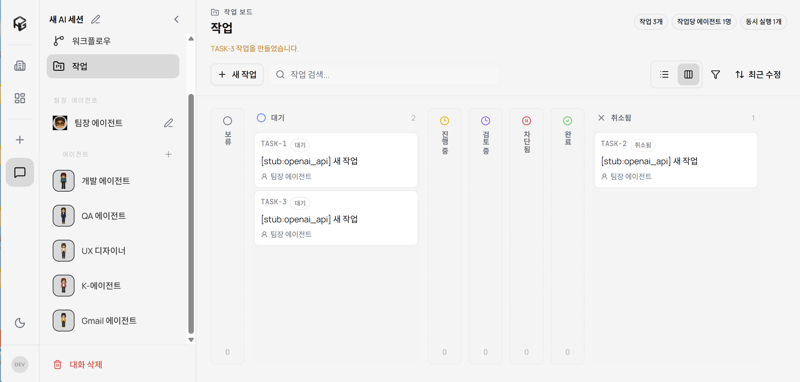
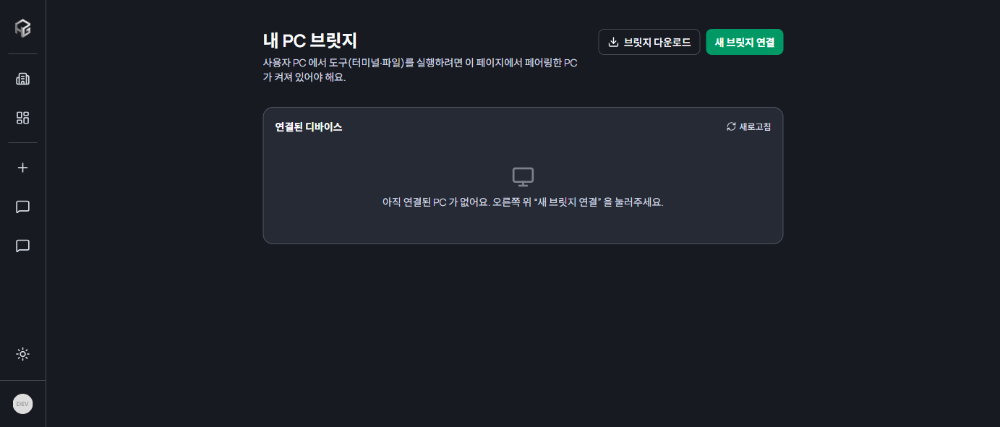
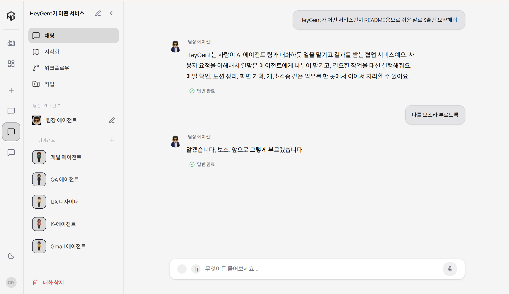
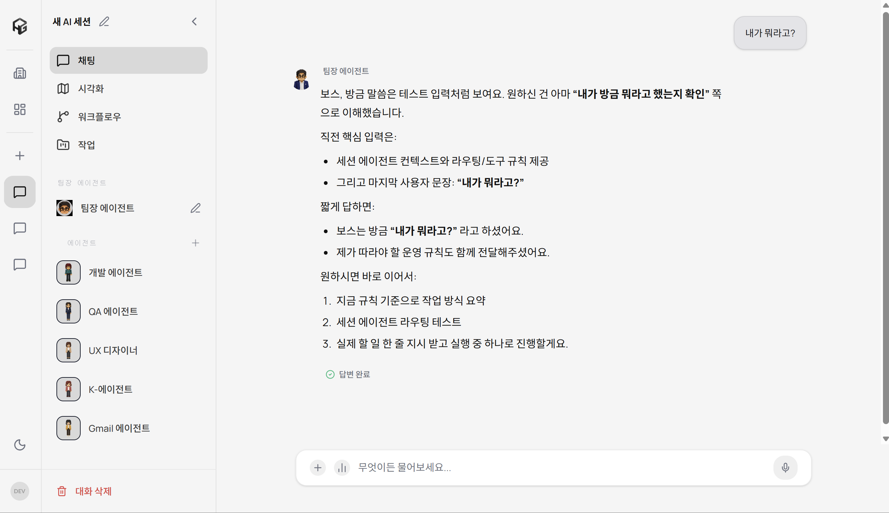
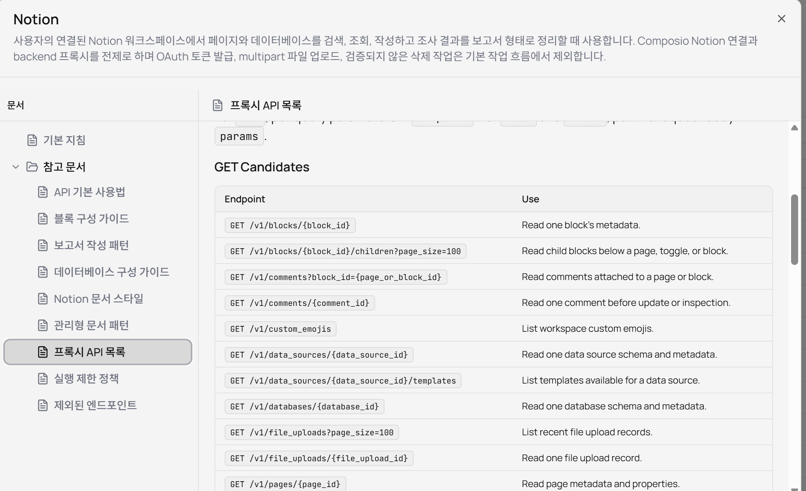
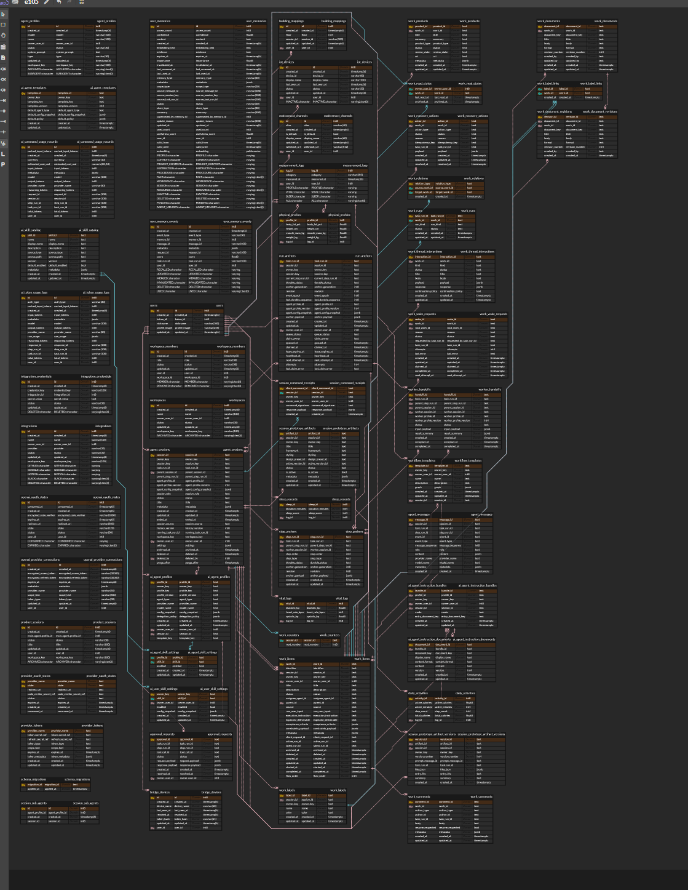

<h1 align="center">

<span style="color:#7C5CFF;">HeyGent</span>
</h1>

---

<p align="center">
  <b>SSAFY 14기 자율 프로젝트</b>
</p>

<br/>

<p align="center">
  <b>웹, 모바일, IoT, 로컬 PC를 하나로 잇는</b><br/>
  <b>AI 오케스트레이션 서비스</b>
</p>

<br/>

<p align="center">
  사용자의 요청을 AI가 작업으로 나누고,<br/>
  웹 화면, 모바일 앱, 갤럭시 워치, IoT 디스플레이, 로컬 브릿지까지 연결하는<br/>
  <b>멀티 디바이스 AI 작업 실행 플랫폼, HeyGent</b>
</p>

<br/>

<p align="center">
  
  
  
  
  
  
</p>

<br/>

<p align="center">
  
</p>

<br/>

## 📑 목차

---

<p align="center">
  <a href="#project-info"><b>🚀 프로젝트 정보</b></a> &nbsp;&nbsp;|&nbsp;&nbsp;
  <a href="#team"><b>🔥 Team</b></a> &nbsp;&nbsp;|&nbsp;&nbsp;
  <a href="#why-heygent"><b>💬 왜 HeyGent인가</b></a> &nbsp;&nbsp;|&nbsp;&nbsp;
  <a href="#features"><b>✨ 주요 기능</b></a> &nbsp;&nbsp;|&nbsp;&nbsp;
  <a href="#structure"><b>📂 프로젝트 구조</b></a> <br><br>
  <a href="#core-pipeline"><b>⚙️ 코어 파이프라인</b></a> &nbsp;&nbsp;|&nbsp;&nbsp;
  <a href="#tech-stack"><b>🛠 기술 스택</b></a> &nbsp;&nbsp;|&nbsp;&nbsp;
  <a href="#docs"><b>📄 개발 상세 문서</b></a> &nbsp;&nbsp;|&nbsp;&nbsp;
  <a href="#data-modeling"><b>🗃 Data Modeling</b></a> <br><br>
  <a href="#architecture"><b>🏗 System Architecture</b></a>
</p>

<br/>

## 🚀 프로젝트 정보 <a id="project-info"></a>

---
<br/>

| 항목 | 상세 내용 |
|:---:|:---|
| 🗓️ **진행 기간** | 2026.04.13 ~ 2026.05.19 |
| 💻 **플랫폼** | Web, Android Mobile, Galaxy Watch 연동, IoT Display, Local PC Bridge |
| 👥 **개발 인원** | 7명 |
| 🏢 **기관** | 삼성 청년 SW·AI 아카데미 SSAFY 14기 |
| 🧩 **프로젝트 형태** | Monorepo(한 저장소 안에 frontend, backend, ai, mobile, bridge, docker를 함께 관리) |

<br/>

## 🔥 Team <a id="team"></a>

---

| Profile | Responsibilities |
|:---:|:---|
| <br>**전희수**<br><sub>AI Lead / Orchestration / FE Integration / Docs</sub> | - HeyGent AI 백본 초기 설계 및 FastAPI 서버 구조 구현<br>- `TaskRun`(사용자 요청 하나를 처리하는 실행 묶음)과 `StepRun`(실행 묶음 안의 단계) 실행 모델 설계<br>- WebSocket 기반 실시간 실행 이벤트, 인증, 구독, fan-out(하나의 이벤트를 여러 화면에 나눠 보내는 동작) 구조 구현<br>- agent loop(모델이 생각하고 도구를 호출하며 작업을 진행하는 반복 실행 구조)와 tool runtime(터미널, 파일, 브라우저, 외부 서비스 도구 실행 계층) 고도화<br>- 에이전트 오케스트레이션, 작업 보드, 실행 기록, 프로토타입 프리뷰, 스킬 선택/주입 흐름 구현 및 안정화<br>- SRT 예약, Notion, Mattermost, 웹/파일/터미널 도구 등 스킬 기반 실행 구조 보강<br>- 루트/AI/협업 문서, AGENTS 규칙, 작업 로그와 설계 결정 문서 정리 |
| <br>**김상지**<br><sub>AI / Memory / IoT / Provider</sub> | - 장기기억(memory) 저장, 회상(recall), 사용 표시(mark used), metadata 검증 흐름 구현<br>- 장기기억 LLM planner(기억을 언제 불러올지 모델이 판단하는 보조 로직)와 writeback(대화에서 새 기억 후보를 뽑아 저장하는 흐름) 고도화<br>- Gemini provider 연결, OpenAI/Gemini 모델 선택, provider별 credential 사용 흐름 보강<br>- IoT display coordinator, MQTT display publisher, 기기 페어링/표시 이벤트 테스트와 계약 보강<br>- semantic step(사람이 이해하기 쉬운 작업 단계명) 재사용 규칙과 orchestration 상태 전이 검증<br>- AI/BE 테스트 보강과 MR/작업 로그 문서화 |
| <br>**장가은**<br><sub>Backend / Auth / Integrations / Memory API</sub> | - Spring Boot 기반 사용자 인증, Kakao 로그인, dev-login, JWT 재발급/로그아웃 흐름 구현<br>- 사용자 프로필, workspace, product session, agent profile, 에이전트 설정, integration credential API 구현<br>- 장기기억 API, memory event 저장, recall category/filter, scope metadata 검증과 품질 테스트 구현<br>- OpenAI Responses API 호출 클라이언트, provider/model 검증, token usage 저장/조회 API 구현<br>- Notion, Mattermost, Gmail 등 외부 서비스 연동을 위한 backend 내부/공개 API 구성<br>- CORS, 로컬 env 로딩, Swagger 설명, backend 테스트와 문서 로그 정리 |
| <br>**이하준**<br><sub>Mobile / Health / Realtime Sync / FCM</sub> | - Android 모바일 앱 구조와 화면 흐름 구현<br>- Kakao/dev 로그인, 채팅 API, 세션 목록, 메시지 송수신 연동<br>- Galaxy Watch / Samsung Health 데이터 수집 및 backend 전송 흐름 구현<br>- Health dashboard 화면과 건강 데이터 조회/표시 기능 개발<br>- WebSocket + FCM(푸시 알림) 기반 모바일 실시간 채팅 동기화 구현<br>- Whisper STT(음성을 텍스트로 바꾸는 기능), WakeWord, 녹음/전사 흐름 구현 및 race condition(동시에 처리되며 꼬이는 문제) 수정<br>- AI 응답 지연 개선을 위한 스트리밍 응답, Redis/DB 연결, credential cache 성능 이슈 보강 |
| <br>**전연수**<br><sub>Frontend / Agent Visualization</sub> | - 웹 초기 퍼블리싱, 로그인 화면, 전역 상태 설계, 주요 UI 배치 작업<br>- 에이전트 시각화 화면의 배경 맵, 캐릭터 스프라이트, CEO/서브에이전트 이동 로직 구현<br>- 단일 시각화 화면 WebSocket 연동, task run 목록/상태/snapshot 조회 연동<br>- 에이전트 클릭 시 상세 패널, 화이트보드 상세 팝업, 말풍선 연동 구현<br>- 층/세션 이동 버튼, 목적지 매핑, 클릭 좌표 제거 등 시각화 UX 안정화<br>- API key 저장 UI와 설정 패널 관련 프론트 버그 수정 |
| <br>**최석원**<br><sub>Mobile UI / Web UI Design / Branding</sub> | - Android 모바일 앱 초기 세팅, 화면 퍼블리싱, 로그인 API 연동, 앱 아이콘 구성<br>- HeyGent 리브랜딩, 로고/좌측 사이드바/대시보드/로그인 화면 등 시각 디자인 수정<br>- 웹 UI 톤 정리, 외부 서비스 연동 탭, 설정 화면, 에이전트 설정 UI 개선<br>- 브릿지 연결 확인창, 툴팁, 서브에이전트 생성/상세/작업 보드 UI 보정<br>- FCM/첨부파일 컨텍스트 관련 모바일/AI 프롬프트 표시 흐름 보강<br>- 사용자에게 보이는 문구와 설정 화면의 사용성을 개선 |
| <br>**이승엽**<br><sub>Infra / Local Bridge / Workflow / Building Mapping</sub> | - Docker Compose, frontend/backend/AI Dockerfile, Postgres/Redis/pgvector 개발 환경 구성<br>- 프론트 운영 포트, Vite allowedHosts, 빌드 캐시 최적화 등 배포/개발 환경 정리<br>- 로컬 브릿지 PoC와 사용자별 페어링 인증 구조 구현<br>- 브릿지 온라인 상태 표시, workspace 동적 변경, 배포 환경 동작 지원<br>- workflow template(반복 가능한 작업 흐름 템플릿)과 Gmail Composio OAuth 연동<br>- 내 사무실/건물 페이지의 층-세션 매핑 API와 프론트 화면 구현<br>- 시각화 stuck 문제, 세션 로딩 최적화, Gmail 통합과 AGENTS 저장 버그 수정 |

<br/>

## 💬 왜 HeyGent인가 <a id="why-heygent"></a>

---

요즘 AI 서비스는 대부분 "채팅창에 물어보고 답을 받는 방식"에 머뭅니다. 하지만 실제 업무는 단순 답변으로 끝나지 않습니다.

- 사용자는 하나의 요청 안에 여러 작업을 섞어 말합니다.
- AI는 검색, 파일 수정, 외부 서비스 호출, 로컬 PC 작업처럼 서로 다른 도구를 써야 합니다.
- 작업이 길어지면 지금 어디까지 진행됐는지, 어떤 단계에서 막혔는지 보기 어렵습니다.
- 웹에서 시작한 일이 모바일, 알림, IoT 기기, 로컬 PC와 자연스럽게 이어지기 어렵습니다.

HeyGent는 이 문제를 "대화형 AI"가 아니라 "AI 작업 실행 플랫폼"으로 풀었습니다.

사용자가 요청하면 HeyGent는 먼저 의도를 이해하고, 필요한 일을 여러 단계로 나눕니다. 답변만 필요한 일은 바로 처리하고, 검색·문서 작성·외부 서비스 연동처럼 역할이 다른 일은 에이전트 오케스트레이션으로 분배합니다. 실행 과정은 `TaskRun`과 `StepRun`으로 저장되며, 웹 화면과 모바일 앱은 WebSocket으로 현재 상태를 실시간으로 받습니다.

내부 용어를 쉽게 풀면 다음과 같습니다.

- `TaskRun`: 사용자의 요청 하나를 실제로 처리하는 실행 묶음입니다.
- `StepRun`: TaskRun 안에서 모델 호출, 도구 실행, 승인 대기처럼 쪼개진 단계입니다.
- `agent loop`: AI가 "생각하기 -> 도구 쓰기 -> 결과 보기 -> 다음 행동 정하기"를 반복하는 실행 구조입니다.
- `tool runtime`: AI가 실제 도구를 실행하는 계층입니다. 터미널 실행, 파일 읽기/쓰기, Notion/Gmail/Mattermost 호출 등이 여기에 들어갑니다.
- `bridge`: 클라우드 AI와 사용자의 로컬 PC를 연결하는 작은 프로그램입니다. 브릿지가 켜져 있으면 AI가 제한된 폴더 안에서 로컬 명령이나 파일 작업을 위임할 수 있습니다.

## ✨ 주요 기능 <a id="features"></a>

---

<table width="100%">
  <tr>
    <td width="25%" align="center"><b>AI 채팅 및 작업 실행</b></td>
    <td width="25%" align="center"><b>에이전트 오케스트레이션</b></td>
    <td width="25%" align="center"><b>실시간 실행 시각화</b></td>
    <td width="25%" align="center"><b>로컬 브릿지</b></td>
  </tr>
  <tr>
    <td align="center"><br><sub>사용자 요청을 TaskRun으로 실행</sub></td>
    <td align="center"><br><sub>작업 담당자, 상태, 댓글, 실행 이력 관리</sub></td>
    <td align="center"><br><sub>에이전트 위치와 작업 흐름 시각화</sub></td>
    <td align="center"><br><sub>브릿지 다운로드와 새 연결 설정</sub></td>
  </tr>
  <tr>
    <td width="25%" align="center"><b>장기기억</b></td>
    <td width="25%" align="center"><b>외부 서비스 스킬</b></td>
    <td width="25%" align="center"><b>모바일 + 워치 + FCM</b></td>
    <td width="25%" align="center"><b>IoT 디스플레이</b></td>
  </tr>
  <tr>
    <td align="center"> <br><sub>사용자 선호와 반복 절차를 기억</sub></td>
    <td align="center"><br><sub>Notion, Gmail, Mattermost, SRT 등 연동</sub></td>
    <td align="center"><sub>Android 채팅, 건강 데이터, 푸시 알림</sub></td>
    <td align="center"><sub>MQTT로 작업 상태를 물리 기기에 표시</sub></td>
  </tr>
</table>

<br/>

  ## 🎬 기능 데모 <a id="demo"></a>

  <table width="100%">
    <tr>
      <td width="33%" align="center">
        <br/>
        <sub><b>로그인 페이지</b></sub>
      </td>
      <td width="33%" align="center">
        <br/>
        <sub><b>카카오 로그인</b></sub>
      </td>
      <td width="33%" align="center">
        <br/>
        <sub><b>대시보드 및 대화 세션</b></sub>
      </td>
    </tr>
    <tr>
      <td width="33%" align="center">
        <br/>
        <sub><b>예시</b></sub>
      </td>
      <td width="33%" align="center">
        <br/>
        <sub><b>에이전트 스킬 및 세부 설정</b></sub>
      </td>
      <td width="33%" align="center">
        <br/>
        <sub><b>작업생성 및 댓글</b></sub>
      </td>
    </tr>
    <tr>
      <td width="33%" align="center">
        <br/>
        <sub><b>워크플로우 설계</b></sub>
      </td>
      <td width="33%" align="center">
        <br/>
        <sub><b>워크플로우 루틴 등록</b></sub>
      </td>
      <td width="33%" align="center">
        <br/>
        <sub><b>상태변경 및 라벨 및 에이전트 설정</b></sub>
      </td>
    </tr>
    <tr>
      <td width="33%" align="center">
        <br/>
        <sub><b>GMAIL 및 MM 연동(외부 서비스)</b></sub>
      </td>
      <td width="33%" align="center">
        <br/>
        <sub><b>노션 연동(외부 서비스)</b></sub>
      </td>
      <td width="33%" align="center">
        <br/>
        <sub><b>API 키 입력</b></sub>
      </td>
    </tr>
    <tr>
      <td width="33%" align="center">
        <br/>
        <sub><b>사무실 에이전트 실시간 시각화</b></sub>
      </td>
      <td width="33%" align="center">
        <br/>
        <sub><b>건물 층간 세션 탐색</b></sub>
      </td>
      <td width="33%" align="center">
        <br/>
        <sub><b>로컬 브릿지 연결</b></sub>
      </td>
    </tr>
    <tr>
      <td width="33%" align="center">
        <br/>
        <sub><b>장기기억 chat1</b></sub>
      </td>
      <td width="33%" align="center">
        <br/>
        <sub><b>장기기억 chat2</b></sub>
      </td>
      <td width="33%" align="center">
        <br/>
        <sub><b>k-agent chat</b></sub>
      </td>
    </tr>
    <tr>
      <td width="33%" align="center">
        <br/>
        <sub><b>srt chat</b></sub>
      </td>
      <td width="33%" align="center">
        <br/>
        <sub><b>프로젝트 chat</b></sub>
      </td>
      
    </tr>
  </table>


## 📂 프로젝트 구조 <a id="structure"></a>

---

```text
.
├─ frontend/                 # React/Vite 웹 앱: 채팅, 대시보드, 작업 보드, 에이전트 시각화
├─ backend/                  # Spring Boot API: 인증, 사용자, 외부 연동, 메모리, IoT, 브릿지
├─ ai/                       # FastAPI AI 서버: agent loop, TaskRun, 스킬, 도구 실행, WebSocket
├─ mobile/                   # Android 앱: 모바일 채팅, 건강 데이터, FCM, STT
├─ bridge/                   # 사용자 PC에서 실행되는 로컬 브릿지 프로그램
├─ docker/                   # Mosquitto 등 인프라 설정
├─ docs/                     # 협업 로그, 설계 결정, 인수인계, 아키텍처 문서
├─ compose.yml               # Postgres, Redis, Mosquitto, Backend, AI, Frontend 통합 실행
└─ README.md                 # 프로젝트 소개용 상세 README
```

<br/>

## ⚙️ 코어 파이프라인 <a id="core-pipeline"></a>

---

HeyGent의 핵심은 "사용자 요청을 작업으로 바꾸고, 필요한 실행 도구와 화면에 동시에 연결하는 것"입니다.

<br/>

### 1. AI 작업 실행 파이프라인

> 채팅 요청을 `TaskRun`으로 만들고, 여러 `StepRun`을 거쳐 실제 결과를 만듭니다.

- **Step 1. 사용자 요청 수신**<br/>
  웹 또는 모바일에서 사용자가 자연어로 요청합니다. 예를 들어 "내 메일에서 이번 주 뉴스레터 요약해줘"처럼 말합니다.

- **Step 2. 작업 컨텍스트 구성**<br/>
  현재 대화, 연결된 도구, 사용 가능한 스킬, 사용자 장기기억, API 키 상태를 모읍니다. 컨텍스트는 AI가 판단할 때 참고하는 배경 정보입니다.

- **Step 3. 에이전트 오케스트레이션 판단**<br/>
  바로 답할지, 작업을 나눌지, 도구를 써야 하는지 판단합니다.

- **Step 4. 도구 실행**<br/>
  필요한 경우 `terminal`, `file`, `notion`, `gmail`, `mattermost`, `prototype`, `browser`, `skills` 같은 도구를 실행합니다.

- **Step 5. 결과 관찰과 다음 행동 결정**<br/>
  도구 결과를 다시 모델에 전달해 "완료", "추가 작업", "사용자 확인 필요", "막힘" 중 어디에 해당하는지 판단합니다.

- **Step 6. 실행 기록 저장과 화면 반영**<br/>
  TaskRun/StepRun/Event가 저장되고, WebSocket으로 웹과 모바일 화면에 실시간 반영됩니다.

<br/>

### 2. 에이전트 오케스트레이션 파이프라인

> 긴 요청을 여러 작업으로 쪼개고, 역할에 맞게 실행 순서와 담당 흐름을 조율합니다.

- **작업 생성**: 사용자의 큰 요청을 작업 보드의 항목으로 만듭니다.
- **역할 분배**: 검색, 문서 작성, 검증, 외부 서비스 호출처럼 성격이 다른 일을 분리합니다.
- **상태 관리**: `todo`, `in_progress`, `in_review`, `blocked`, `done`처럼 상태를 나눕니다.
- **관계 관리**: 부모 작업, 하위 작업, 관련 작업, 작업 문서, 결과물을 연결합니다.
- **자동 wake**: 하위 작업이 끝났을 때 부모 작업을 다시 깨워 이어서 진행합니다. wake는 멈춰 있던 작업을 다시 실행 대기열에 올리는 뜻입니다.

<br/>

### 3. 장기기억 파이프라인

> 사용자의 선호, 반복 지시, 개인 정보성 사실을 기억하고 다음 대화에서 다시 사용합니다.

- **후보 추출**: 대화에서 기억할 만한 내용을 찾습니다.
- **분류**: 이름, 호칭, 선호, 반복 절차, 작업 방식 같은 category로 나눕니다.
- **중복/충돌 판단**: 기존 기억과 같은지, 업데이트해야 하는지, 폐기해야 하는지 판단합니다.
- **저장**: backend memory API에 저장합니다.
- **recall**: 다음 요청 때 필요한 기억만 다시 불러옵니다.
- **mark used**: 실제 답변에 사용된 기억을 표시합니다. 이것은 나중에 "쓸모 있는 기억"을 구분하는 근거가 됩니다.

<br/>

### 4. 로컬 브릿지 파이프라인

> 클라우드 AI가 사용자 PC 작업을 안전하게 위임할 수 있게 합니다.

- **페어링 코드 발급**: 웹에서 브릿지 연결용 코드를 만듭니다.
- **브릿지 실행**: 사용자가 PC에서 `bridge` 프로그램을 실행하고 코드를 입력합니다.
- **인증/연결**: backend가 사용자별 브릿지 기기를 인증하고, AI 서버는 내부 WebSocket으로 브릿지 상태를 확인합니다.
- **도구 위임**: AI가 로컬 파일 읽기/쓰기, patch, terminal 명령을 요청하면 브릿지가 사용자 PC에서 실행합니다.
- **보안 제한**: 브릿지는 `BRIDGE_WORKSPACE_ROOT`로 지정한 폴더 안에서만 파일 작업을 수행합니다.

<br/>

### 5. 멀티 디바이스 알림/시각화 파이프라인

> 실행 상태를 웹, 모바일, IoT 기기에서 동시에 볼 수 있게 합니다.

- **웹**: React 화면에서 채팅, 작업 보드, 에이전트 시각화, 실행 기록을 보여줍니다.
- **모바일**: Android 앱에서 채팅과 건강 데이터를 다루고, FCM으로 완료 알림을 받습니다.
- **워치/헬스**: Samsung Health 데이터를 수집해 backend에 전달합니다.
- **IoT**: MQTT로 작업 상태를 디스플레이 기기에 발행합니다.

## 🛠 기술 스택 <a id="tech-stack"></a>

---

### 🎨 Frontend

<p align="center">
  
  
  
  
  
  
</p>

<br/>

| Category | Spec |
| --- | --- |
| Language | TypeScript |
| Framework | React 19, Vite 8 |
| Routing | React Router 7 |
| State | Zustand |
| UI | Radix UI, shadcn/ui style components, Lucide React |
| Styling | Tailwind CSS 4 |
| Visualization | Three.js, React Three Fiber, D3, GSAP, Framer Motion |
| Realtime | WebSocket client, Firebase Messaging |
| Build Tool | Vite |

### 🔖 Backend

<p align="center">
  
  
  
  
  
  
</p>

<br/>

| Category | Spec |
| --- | --- |
| Language | Java 21 |
| Framework | Spring Boot 3.5.13 |
| Security | Spring Security, OAuth2 Resource Server, JWT |
| Database | PostgreSQL, pgvector |
| Cache / Session | Redis |
| API Docs | Springdoc OpenAPI |
| Messaging | Spring Integration MQTT, Eclipse Paho |
| Build Tool | Gradle |
| Code Style | Checkstyle 기반 Naver rule |

### 📈 AI Runtime

<p align="center">
  
  
  
  
  
  
</p>

<br/>

| Category | Spec |
| --- | --- |
| Language | Python 3.11+ |
| Framework | FastAPI, Uvicorn |
| Realtime | WebSocket, Redis Pub/Sub |
| Model Providers | OpenAI, Gemini |
| Runtime Tools | terminal, file, planning, work, delegation, browser, web, Notion, Gmail, Mattermost, prototype |
| Storage | PostgreSQL durable repository, Redis projection/cache |
| Test | pytest, pytest-asyncio |
| Features | TaskRun/StepRun, agent loop, agent orchestration, skill catalog, workflow template, long-term memory context |

### 📱 Mobile

<p align="center">
  
  
  
  
  
</p>

<br/>

| Category | Spec |
| --- | --- |
| Language | Kotlin |
| UI | Jetpack Compose, Material3 |
| Network | Retrofit, OkHttp |
| Login | Kakao SDK |
| Push | Firebase Cloud Messaging |
| Health | Samsung Health SDK |
| Voice | STT, WakeWord, Whisper API 연동 흐름 |

### 🗃️ DevOps / Infra

<p align="center">
  
  
  
  
  
  
</p>

<br/>

| Category | Spec |
| --- | --- |
| Container | Docker, Docker Compose |
| Services | frontend, backend, ai, postgres, redis, mosquitto |
| DB | PostgreSQL + pgvector |
| Cache | Redis |
| IoT Messaging | Mosquitto MQTT |
| Local PC | Python bridge client |
| Collaboration | GitLab, Jira, Notion, Mattermost, Figma, Discord |

<br/>

## 📄 개발 상세 문서 <a id="docs"></a>

---

루트 README에서는 전체 흐름을 빠르게 볼 수 있고, 세부 구조는 `docs/architecture/` 아래에서 나눠 확인할 수 있습니다.

<table width="100%">
  <tr>
    <td width="30%" align="center"><b>아키텍처 인덱스</b></td>
    <td width="70%" align="center"><a href="docs/architecture/README.md">docs/architecture/README.md</a></td>
  </tr>
  <tr>
    <td align="center"><b>시스템 개요</b></td>
    <td align="center"><a href="docs/architecture/overview/system-overview.md">docs/architecture/overview/system-overview.md</a></td>
  </tr>
  <tr>
    <td align="center"><b>Frontend 구조</b></td>
    <td align="center"><a href="docs/architecture/frontend/app-structure.md">docs/architecture/frontend/app-structure.md</a></td>
  </tr>
  <tr>
    <td align="center"><b>Backend 도메인 맵</b></td>
    <td align="center"><a href="docs/architecture/backend/domain-map.md">docs/architecture/backend/domain-map.md</a></td>
  </tr>
  <tr>
    <td align="center"><b>AI 서비스 맵</b></td>
    <td align="center"><a href="docs/architecture/ai/service-map.md">docs/architecture/ai/service-map.md</a></td>
  </tr>
  <tr>
    <td align="center"><b>Mobile 구조</b></td>
    <td align="center"><a href="docs/architecture/mobile/app-structure.md">docs/architecture/mobile/app-structure.md</a></td>
  </tr>
  <tr>
    <td align="center"><b>Bridge 구조</b></td>
    <td align="center"><a href="docs/architecture/bridge/local-bridge.md">docs/architecture/bridge/local-bridge.md</a></td>
  </tr>
  <tr>
    <td align="center"><b>Infra 배포 구조</b></td>
    <td align="center"><a href="docs/architecture/infra/deployment-layout.md">docs/architecture/infra/deployment-layout.md</a></td>
  </tr>
</table>

<br/><br/>

## 🗃 Data Modeling <a id="data-modeling"></a>

---

<p align="center">
  
</p>

<p align="center">
  <sub>현재 주요 저장소는 PostgreSQL이며, 장기기억/실행 기록/에이전트/외부 연동/IoT/브릿지 도메인이 backend와 AI 양쪽에서 연결됩니다.</sub>
</p>

<br/>

핵심 데이터 묶음은 다음과 같습니다.

- **User/Auth**: 사용자, Kakao 로그인, JWT, API key/provider 연결 상태
- **Agent/Session**: 대화 세션, 에이전트 오케스트레이션 설정, 에이전트 프로필, 스킬 설정
- **TaskRun/StepRun/Event**: AI 실행 묶음, 실행 단계, 실시간 이벤트
- **Work Board**: 작업, 하위 작업, 댓글, 라벨, 관계, 문서, 결과물, 실행 이력
- **Memory**: 장기기억 후보, 저장된 기억, 기억 이벤트, recall/used 기록
- **Integration**: Notion, Gmail, Mattermost, OpenAI/Gemini provider credential
- **Device**: IoT 기기, display event, bridge device, pairing session
- **Health**: Samsung Health 기반 활동/수면/측정 데이터

<br/><br/>

## 🏗 System Architecture <a id="architecture"></a>

---

```text
             [Web Frontend]         [Android Mobile]
                    |                      |
                    | HTTP / WebSocket     | HTTP / FCM / WebSocket
                    v                      v
              +-------------------------------+
              |        Backend API            |
              | Auth / User / Memory / IoT    |
              | Provider / Bridge / Integr.   |
              +---------------+---------------+
                              |
                              | internal auth / credential / service API
                              v
              +-------------------------------+
              |          AI Server            |
              | TaskRun / StepRun / AgentLoop |
              | Skill Runtime / Tool Runtime  |
              +------+-----------+------------+
                     |           |
          WebSocket |           | MQTT / Internal API
                     v           v
           [Local Bridge]    [IoT Display]
             User PC         Mosquitto topic

Infra: Docker Compose + PostgreSQL(pgvector) + Redis + Mosquitto
```

<br/><br/>
